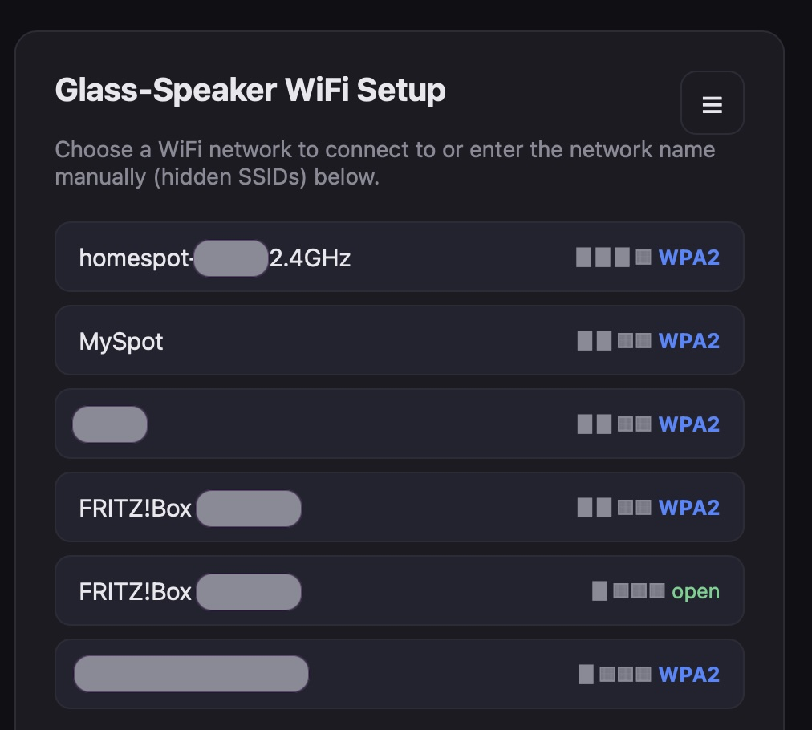
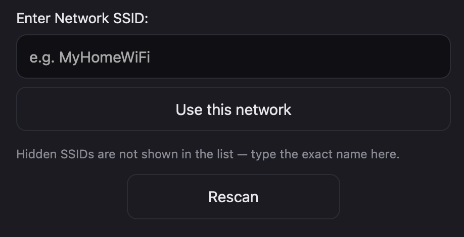
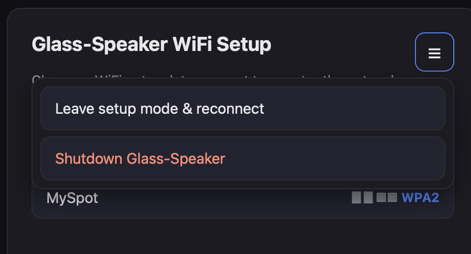
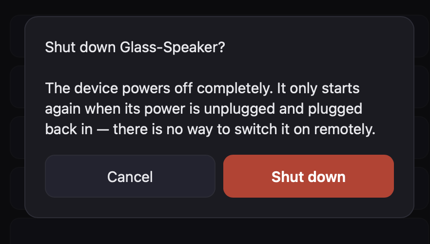
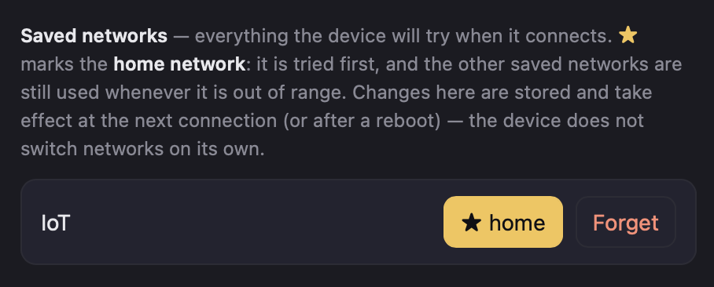

# wifi-setup for Pi Zero W

**WiFi that fixes itself on a headless Raspberry Pi** — a fallback access point
with a setup page, for devices that have no screen, no keyboard and often no
Ethernet port (built and tested on a Pi Zero W).

The Pi keeps a list of saved WiFi networks and connects to whichever one is in
range. If none is reachable, it opens its own access point — named after the
device, e.g. `kitchen-radio-Setup` — and your phone shows a setup page on its
own (captive portal). Pick a network, type the password, done: the Pi switches
over without a reboot.

<p align="center">
  
</p>

- **Self-healing** — stays running as a small supervisor. A lost link is
  retried first; only if no saved network comes back within 60 s does the
  setup AP open. It happens live, at any time, not just at boot.
- **Several saved networks** with one optional **home network** that is
  always tried first, the others as fallback.
- **Secure by default** — WPA2-protected setup AP (password generated at
  install), HTTPS for the page, only a hashed PSK is ever stored. An open AP is
  possible but powers the device off after 15 minutes.
- **Light** — Python 3 standard library only (no Flask, no pip packages);
  `hostapd` + `dnsmasq` do the AP. Comfortable on a Pi Zero W.
- **One-command install**, re-runnable, never forgets saved networks.

---

## Requirements

- Raspberry Pi with on-board WiFi (`wlan0`). Developed on a **Pi Zero W**.
- **Raspberry Pi OS Bullseye** (or *Legacy*) using **dhcpcd + wpa_supplicant**
  — the classic networking stack.
  > **Not supported:** systems where **NetworkManager** manages WiFi — that is
  > the default on Raspberry Pi OS **Bookworm and later**. The installer detects
  > it and stops without changing anything.
- Internet access during install (to `apt-get install hostapd dnsmasq iw
  wireless-tools openssl`; already-installed packages are skipped).
- SSH enabled (the installer enables it) — your way in while the setup AP is up.

## Install

```bash
# 1. Get the code onto the Pi (git, or copy the folder over with scp)
git clone https://github.com/wotography/pi-zero-w-wifi-setup.git && cd wifi-setup

# 2. Install (asks how to secure the setup AP and, if unknown, your WiFi country)
sudo bash wifi_setup.sh

# 3. Start it (or just reboot)
sudo systemctl start wifi-setup
```

The installer asks once how to protect the setup AP — **choose 1 (generated
password)** and note it down; it is also stored in `/etc/wifi-setup/wifi-setup.env`.
Non-interactive: `sudo WIFI_AP_PASSWORD='a-long-password' WIFI_COUNTRY=GB bash wifi_setup.sh`.
An own AP password must be **8–63 plain ASCII characters** — no umlauts, no `€`:
WPA2 does not define other characters, and many phones then cannot join.

Good to know:

- **Back up first** if the Pi already has working WiFi:
  `sudo cp /etc/wpa_supplicant/wpa_supplicant.conf ~/wpa_supplicant.conf.bak`.
  From now on `/etc/wpa_supplicant/wpa_supplicant.conf` is **generated** from
  the network store (`/etc/wifi-setup/known-wifi.json`) on every start.
- **Pre-seed networks** before installing by filling in `config/known-wifi.json`
  (format below). It ships empty — never commit real credentials to it.
- Re-running the installer is safe: the store and the env file are kept.

### No `git` on the Pi?

From your computer: `scp -r wifi-setup pi@<pi-ip>:/tmp/`, then
`sudo bash /tmp/wifi-setup/wifi_setup.sh` on the Pi.

## Using the setup page

When no saved network is reachable, join the **`<hostname>-Setup`** WiFi with
the AP password. **The setup page opens by itself** in your phone's or
laptop's "Sign in to network" window. The page uses HTTPS with a self-signed
certificate, so that window first shows a certificate warning — confirm it once.
If nothing pops up, browse to `http://192.168.4.1` (or `http://<hostname>.setup`).

> **iPhone/iPad:** don't tap *Cancel* in the sign-in window — iOS then leaves
> the setup WiFi. Choose *Use Other Network → Use Without Internet*, or keep the
> window open.

1. **Pick your network** from the list (✓ = already saved, ★ = home network),
   or type a hidden SSID by hand. Not listed? Tap **Rescan** — the setup AP
   drops for a few seconds to scan, and your phone reconnects on its own.

   
2. **Enter the password** (empty for an open network). Tick **Make this my
   home network** if the device should always try this one first.
3. **Save & connect** switches over immediately, no reboot. If that fails,
   **Save & reboot** is the robust fallback. The page shows the log tail of
   the attempt.

The **☰ menu** has **Leave setup mode & reconnect** (back to the saved networks
without a reboot) and **Shutdown &lt;name&gt;** (powers the device off — it only
comes back when you unplug and replug its power, so it asks first):

<p align="center">
  
  &nbsp;
  
</p>

The **Saved networks** section lets you move the ★ (home network) or **Forget**
a network. Both are only stored and take effect at the next connection:

<p align="center">
  
</p>

While the setup AP is up the device is not on your normal network, so any
service running on it (and anything that talks to it) looks offline until it
reconnects — that is expected.

## Device name

Everything you see is named after the Pi's **hostname** (change it with
`sudo raspi-config` → *System Options → Hostname*), unless you override it in
`/etc/wifi-setup/wifi-setup.env`:

| What | Default | Override |
|---|---|---|
| Page title, header, `Shutdown <name>` | `<hostname>` | `WIFI_DEVICE_NAME` |
| Setup AP name | `<name>-Setup` (cut to the 32-byte SSID limit) | `WIFI_AP_SSID` |
| Local address of the page | `<name>.setup`, lowercase, `a-z 0-9 -` only | `WIFI_SETUP_DOMAIN` |

The self-signed certificate follows the name and is regenerated after a rename;
a certificate you supply via `WIFI_CERT` / `WIFI_KEY` is never touched. Restart
the service (`sudo systemctl restart wifi-setup`) after renaming.

## Configuration

Settings live in `/etc/wifi-setup/wifi-setup.env` (created by the installer;
`KEY=value` lines). Restart the service after a change. The most useful ones:

| Variable | Default | Meaning |
|---|---|---|
| `WIFI_AP_PASSWORD` | *(set at install)* | Password of the setup AP: 8–63 printable ASCII characters. Empty = **open AP** (device powers off after `WIFI_AP_AUTO_OFF_SECONDS`). |
| `WIFI_COUNTRY` | from existing conf / crda, else asked | WiFi regulatory country (`GB`, `DE`, `US`, …). |
| `WIFI_DEVICE_NAME`, `WIFI_AP_SSID`, `WIFI_SETUP_DOMAIN` | see [Device name](#device-name) | Names. |
| `WIFI_AP_CHANNEL` | `6` | Channel of the setup AP (2.4 GHz). |
| `WIFI_CONNECT_TIMEOUT` | `90` | Seconds to find a saved network at boot before opening the setup AP. |
| `WIFI_SETUP_TIMEOUT` | `60` | Seconds of lost link (after boot) before opening the setup AP. |
| `WIFI_AP_AUTO_OFF_SECONDS` | `900` | Open AP only: power off after this long. |
| `WIFI_CAPTIVE_PORTAL` | `1` | `0` = no captive portal (no wildcard DNS, no redirect). |
| `WIFI_CONFIG_PORT` | `443` with a cert, else `80` | Port of the setup page. |
| `WIFI_IFACE` | `wlan0` | WiFi interface. |
| `WIFI_LOG_LEVEL` | `INFO` | Log verbosity. |

Less common knobs (`WIFI_AP_FAIL_LIMIT`, `WIFI_AP_RESTORE_GRACE`,
`WIFI_POLL_INTERVAL`, `WIFI_LOG_MAX_BYTES`, paths, …) are documented next to
their definition at the top of `wifi_setup_daemon.py`.

### The network store

`/etc/wifi-setup/known-wifi.json` (mode 0600, root only) is the single source
of truth; the setup page writes it for you. By hand:

```json
{
  "networks": [
    { "ssid": "Home-WLAN", "psk": "<64 hex chars>", "preferred": true },
    { "ssid": "Backup-WLAN", "password": "plain passphrase also works" },
    { "ssid": "Open-Guest-Net", "password": "" }
  ]
}
```

- `psk` is the precomputed WPA2 key: `wpa_passphrase "Home-WLAN" "<password>"`
  prints it. The setup page only ever stores this hash, never the passphrase.
- `"password": ""` = open network. Passphrases are 8–63 characters.
- `"preferred": true` marks the home network (at most one). It is tried first;
  the others remain fallbacks — see [docs/DESIGN.md](docs/DESIGN.md#the-home-network-is-a-preference-not-a-pin).

## Security

The page exists to receive a WiFi password, so:

- **Protect the setup AP with a password** (the installer's default). Only
  people who know it can even see the page.
- **HTTPS**: a self-signed certificate is created automatically, so the password
  you type is encrypted even against others on the setup AP.
- The page listens **only on the setup AP address** (`192.168.4.1`), never on
  other interfaces, and only while setup mode is active.
- **Captive portal without opening a hole**: in setup mode every DNS name
  resolves to the AP, so phones find the page; requests for foreign host names
  get a redirect only — never page content or data — and every state-changing
  request from a foreign host or origin is refused (DNS-rebinding/CSRF guard).
- An **open** setup AP (no password) is possible but discouraged; the device
  powers itself off after 15 minutes so it is never left open.
- Only the **hashed PSK** is stored, in a root-only file. Treat it like the
  password itself: it *is* the WPA2 key.

## Logs and troubleshooting

```bash
sudo tail -n 80 /etc/wifi-setup/daemon.log          # what the daemon did and why
sudo python3 /opt/wifi-setup/wifi_setup_daemon.py --diagnose --redact   # read-only health report
```

Every log line carries `[up H:MM:SS]` (time since boot): the Pi has no
real-time clock, so right after a power cut the wall-clock timestamps can be off
until NTP syncs — the log says so explicitly. More in
[docs/TROUBLESHOOTING.md](docs/TROUBLESHOOTING.md).

> **Headless devices:** restarting the service or saving a network re-captures
> `wlan0` and drops an SSH session that runs over WiFi. Read
> [docs/DEVELOPMENT.md](docs/DEVELOPMENT.md#updating-a-device-you-can-only-reach-over-wifi)
> before updating a device you cannot physically reach.

## Uninstall

```bash
sudo systemctl disable --now wifi-setup
sudo rm /etc/systemd/system/wifi-setup.service /etc/dnsmasq.d/wifi-setup.conf
sudo rm -r /opt/wifi-setup /etc/wifi-setup          # deletes the saved networks!
sudo cp ~/wpa_supplicant.conf.bak /etc/wpa_supplicant/wpa_supplicant.conf  # your backup
sudo systemctl daemon-reload && sudo reboot
```

The installer disabled the `hostapd`/`dnsmasq` services, enabled
`wpa_supplicant@wlan0` (disabling the monolithic `wpa_supplicant` unit) and
enabled `ssh`; revert those if you want the previous state back.

## More

- [docs/DESIGN.md](docs/DESIGN.md) — how it works and why
- [docs/TROUBLESHOOTING.md](docs/TROUBLESHOOTING.md) — diagnosis and recovery
- [docs/DEVELOPMENT.md](docs/DEVELOPMENT.md) — tests, off-device checks, safe updates
- [Changelog.md](Changelog.md) · [Roadmap.md](Roadmap.md)

## License

Mozilla Public License Version 2.0
